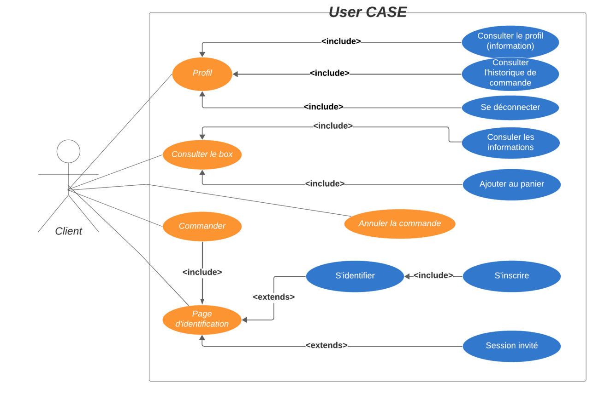
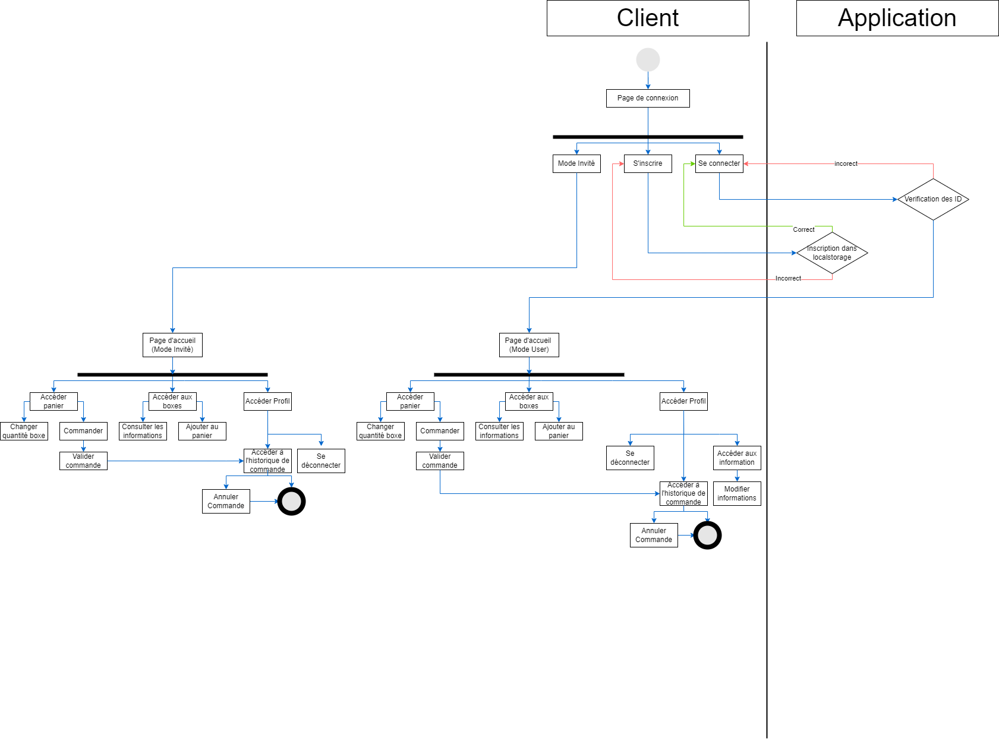
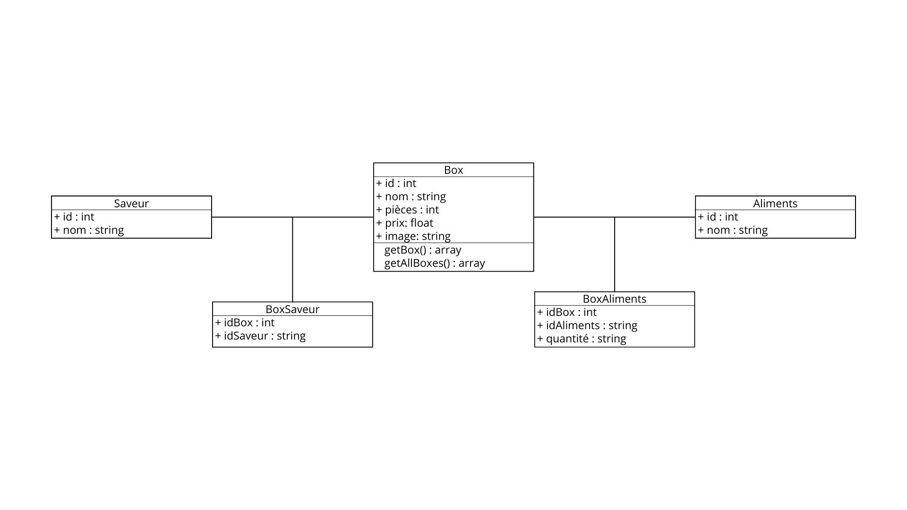
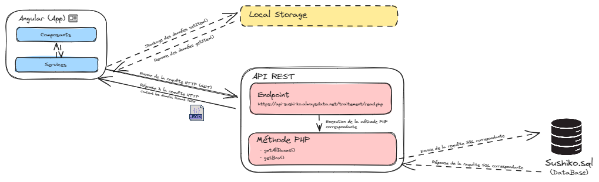
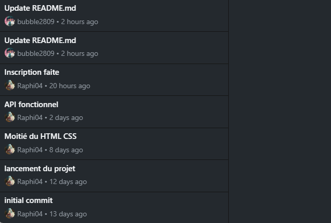

# SAE401

## LIVRABLE  L401_1
Vous retrouverez dans ce document l’ensemble les maquettes des personnes impliquées dans ce projet, le contexte, les contraintes et le déroulement du projet.

### Répartition des tâches

#### Inès TEMMAR
Responsable de coordonner toutes les activités liées au projet. Son rôle consiste à définir les objectifs du projet, à planifier les différentes étapes de développement, à allouer les ressources nécessaires, à superviser l'avancement du travail et à s'assurer que le projet est livré dans les délais impartis en respectant les exigences définies par l'équipe.

#### Yanis WONG
Responsable de la conception de l'expérience utilisateur (UX) et l'interface utilisateur (UI) du site de commande de sushis en ligne. Son rôle consiste à comprendre les besoins et les attentes des utilisateurs finaux, à créer des wireframes et des maquettes pour visualiser l'interface utilisateur, à concevoir des interfaces conviviales et attrayantes, et à s'assurer que l'expérience de navigation sur le site est intuitive et efficace. Une fois cette phase terminée, Yanis s'occupera également de la partie front-end du développement en collaboration avec Hugo BAJOUE.

#### Raphael CADETE
Responsable du développement de la partie back-end et front-end du site de commande de sushis en ligne. Son rôle consiste à concevoir et à développer la structure du site, à créer la logique et les fonctionnalités du côté serveur, à intégrer les bases de données, à optimiser les performances du site et à assurer sa sécurité. Il travaille en étroite collaboration avec le développeur front-end pour garantir que l'interface utilisateur est correctement implémentée et fonctionne de manière cohérente avec le back-end.

#### Hugo BAJOUE
Responsable du développement de la partie front-end du site de commande de sushis en ligne, ainsi que du rendu des livrables. Son rôle consiste à traduire le design fourni par le UX/UI designer en code informatique, à créer des interfaces utilisateur interactives et réactives, à assurer la compatibilité multiplateforme et à optimiser les performances du site du côté client. Il travaille en étroite collaboration avec le développeur full-stack pour garantir une intégration fluide entre le front-end et le back-end, et il est responsable de la livraison des éléments front-end conformément aux spécifications du projet.

### Nom et Logo
Notre application porte le nom de Sushi.ko et a pour logo :

### Analyse des besoins de l'application

### Diagramme d'activités

### Diagramme des classes

### Architecture de l'application
Vous trouverez ci-joint l'architecture de l'application SUSHI.KO :
[Architecture](architecture.txt)

## LIVRABLE  L401_2
Vous trouverez ci-joint les codes d'implémentation de l'API REST ainsi que son architecture.

https://github.com/Raphi04/SAE_401/tree/master/api

## LIVRABLE  L401_3
Vous trouverez ci-joint les maquettes des pages suivantes : accueil, panier, détails.

[Maquette](https://www.figma.com/file/YewJCHIxcp26KI8tOVMFAp/Untitled?type=design&node-id=0%3A1&mode=design&t=4KNuZF73xHuQtkNl-1)

## LIVRABLE L401_4
Vous trouverez ci-joint le suivi des mises à jours de la partie FRONT du code :

https://github.com/Raphi04/SAE_401/commits/master/

## LIVRABLE  L401_5
Vous retrouverez dans ce document le compte rendue des tests unitaires, la page pour la prise en compte des droits RGPD ainsi que les deux scénarios malveillants et les mesures pour les contrecarrer.

### Prise en compte des droits RGPD
Dernière mise à jour : 18/03/24

#### Introduction
Bienvenue sur Sushiko.com. Nous accordons une grande importance à la protection de vos informations personnelles et nous nous engageons à respecter votre vie privée conformément au Règlement Général sur la Protection des Données (RGPD) de l'Union européenne.

Cette politique de confidentialité vous informe sur la manière dont nous collectons, utilisons et protégeons vos données personnelles lorsque vous utilisez notre site Internet.

En utilisant notre site, vous consentez à la collecte et à l'utilisation de vos données personnelles telles que décrites dans cette politique.

#### Collecte des informations
Nous collectons certaines informations personnelles lorsque vous utilisez notre site, notamment lorsque vous vous connectez à votre compte et que vous utilisez notre fonction de panier. Les informations collectées peuvent inclure votre adresse e-mail, votre mot de passe, votre historique de commande et les articles ajoutés à votre panier. Ces informations sont stockées localement sur votre appareil à l'aide de la technologie LocalStorage de votre navigateur, et ne sont pas transmises à nos serveurs.

#### Utilisation des informations
Les informations collectées via la fonction de connexion et de panier sont utilisées uniquement dans le cadre de votre expérience sur notre site. Elles ne sont pas partagées avec des tiers et ne sont pas utilisées à des fins de marketing.

#### Protection des informations
Nous mettons en place des mesures de sécurité techniques et organisationnelles appropriées pour protéger vos informations personnelles stockées localement sur votre appareil contre tout accès non autorisé, divulgation, altération ou destruction.

#### Vos droits
Vous avez certains droits sur vos données personnelles, y compris le droit d'accéder, de rectifier, de limiter ou de supprimer vos informations stockées localement sur votre appareil. Vous pouvez gérer ces informations en ajustant les paramètres de votre navigateur ou en supprimant les données stockées.

#### Modifications de la politique de confidentialité
Nous nous réservons le droit de modifier cette politique de confidentialité à tout moment. Toute modification sera publiée sur cette page avec la date de mise à jour.

#### Contactez-nous
Si vous avez des questions concernant cette politique de confidentialité, veuillez nous contacter à l'adresse TEMMAR.Ines77@gmail.com.

### Deux scénarios malveillants et les mesures pour le contrecarrer

#### Scénario 1 : Un attaquant tente d'accéder aux identifiants de l'utilisateur via le local Storage.Il accéde même au local storage  Cela peut compromettre la sécurité des comptes utilisateur et permettre à l'attaquant d'accéder à des fonctionnalités sensibles, comme passer des commandes sous un compte qui n'est pas le sien.

##### Les contremesures :

- Hasher les mots de passes dans le local storage
- Limiter le nombre de tentatives de connexion avant un blocage temporaire. Par exemple, après trois tentatives infructueuses, le compte est verrouillé pendant un certain temps.
- Encourager les utilisateurs à choisir des mots de passe robustes et à ne pas utiliser des combinaisons faciles à deviner.

#### Scénario 2 : Un attaquant tente de passer des commandes sans se connecter ou s'inscrire.

##### Les contremesures :

- Vérifications de session en début de chaque fichier pour s'assurer que la personnes s'est inscrite ou connecter. Si ce n'est pas le cas, elle est redirigée vers l'espace de connexion. Elle ne peut donc pas accéder par injection d'URL.
